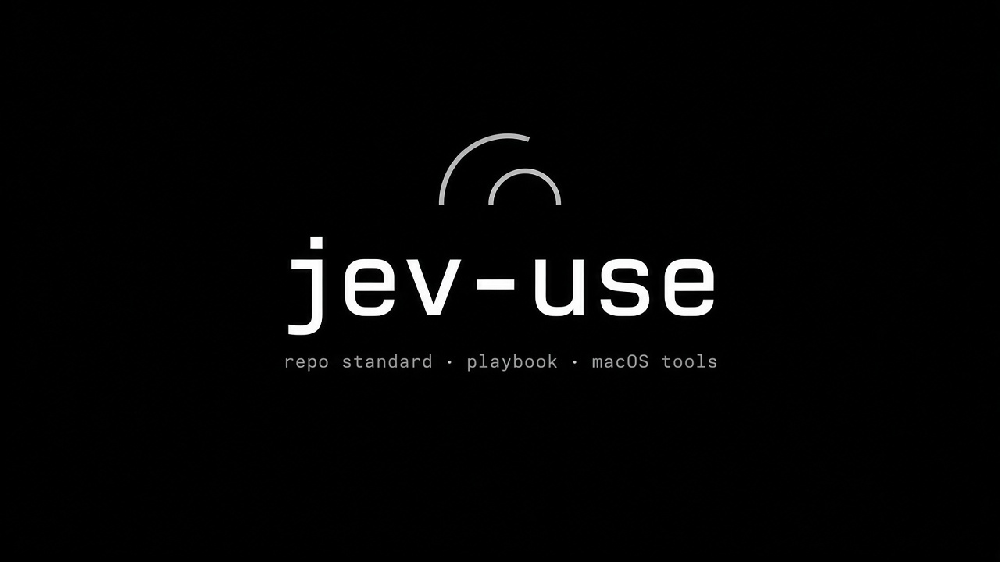
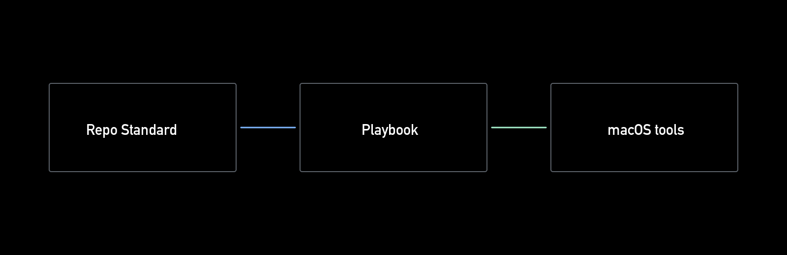

<div align="center">



# jev-use

**Speak a goal. The Mac does it.**

A voice-driven control layer for macOS: it observes the screen through the accessibility
tree and drives it, with everything running locally.

`product source · pre-alpha · no release yet`


</div>

> **Two things live here:** the macOS automation runtime, and the canonical copy of the
> **Repo Standard** every repository in this fleet carries. Both are described below.
>
> **No release yet.** There is no installer, no notarised build and no Homebrew tap, so today
> you clone it and build it. That is the honest state, not a placeholder.



## What works today, and what does not

| Piece | State | Evidence |
| --- | --- | --- |
| **Observation** - walk an app's accessibility tree into an indexed element table | **done** | at parity with the reference on four apps: Finder 12/12 elements, Terminal 13/13, PI-Desktop 10/10 (Electron), Notes 8/8, with identical fingerprints. Reproduce: `scripts/parity --live <app>` |
| **Parity harness** - prove the port matches the reference | **done** | `scripts/parity --capture/--check/--live`; the specification is pinned by hash in `reference/PINNED.json` |
| **Settings** - one file, one command, one menu | **done** | `jev-config`, `jev-config doctor` |
| **Voice hook** - decide command vs dictation, then act or type | **done, in daily use** | measured: 0.24-0.33 s to paste a dictation, 6-15 ms to hand a command off |
| **Execution** - press, write, type into the chosen element | **not yet (T6)** | the walk can observe but not act |
| **CLI** - `jev-use-rs --table --app <App>` | **not yet (T7)** | until then the walk is driven through `crates/jev-ax/examples/walk.rs`, which prints the reference's JSON shape |
| **App UI** - the glass pill | **not yet (T12)** | blocked on execution, because it needs a real action to display |

The board is [`docs/tasks.md`](docs/tasks.md). Every item there carries what it proved.

## Try it

Requires macOS 26 with a Rust toolchain, and your terminal needs the Accessibility grant
(System Settings, Privacy and Security, Accessibility) for anything to see a screen.

```bash
cargo test --workspace                              # 77 tests
cargo run --example list_apps -p jev-ax             # the apps a walk can see
cargo run --example walk -p jev-ax -- --app Finder --json   # one observation, as JSON
```

To watch the parity harness compare this implementation against the reference it is ported
from (needs `pyobjc`, and nothing else):

```bash
python3 scripts/parity --live Finder \
  --port-cmd "cargo run --quiet --example walk -p jev-ax -- --app {app} --json"
```

## How it works

```
voice (a hotkey you already own, or CoCo Voice's hook)
   |
   v
decide: command or dictation?        crates/jev-voice, pure and testable on any platform
   |
   v
resolve: which capability fulfils it? (a capability registry; ~50 ms, no model)
   |
   v
observe: read the screen              crates/jev-ax, the accessibility tree
   |
   v
act: press, write or type             crates/jev-ax (T6)
```

The layer boundary is deliberate: `jev-ax` knows nothing about models, and the decision layer
knows nothing about the screen. They meet one layer up. That is why the port could be proven
without a model, and why a model can be tested without a screen.

`crates/jev-ax` is a **port** of a working implementation, not a rewrite, and it is judged
against it: same elements, same order, same fingerprints. `reference/` explains that
relationship, and `reference/PINNED.json` records the exact pinned revision.

## The Repo Standard

This repo holds the canonical copy of the standard every repository here carries:
[`docs/repo-playbook.html`](docs/repo-playbook.html) (**Revision 5, 2026-09-20**).

| Tool | What it does |
| --- | --- |
| `scripts/standard-sync` | Compares every repository's copy against the canonical one (`--check`), or redeploys it (`--write`). It refuses to deploy a playbook that declares no revision, and refuses to write into a directory that is not a repository. |
| `scripts/repo-check` | Audits a repo against the standing rules: required files, credentials, machine paths, the six documents, and whether the standard still documents the checks the tool runs. |

```bash
python3 scripts/repo-check              # this repo
python3 scripts/repo-check --repo PATH  # any repo
python3 scripts/standard-sync --check   # is every copy identical?
```

## Start here if you are reading to contribute

1. [`AGENTS.md`](AGENTS.md) — read this before any edit; it maps the authority order.
2. [`CONTRIBUTING.md`](CONTRIBUTING.md) — the loop, branch naming, PR size.
3. [`docs/rules.md`](docs/rules.md) — the invariants, each with the measurement behind it.
4. [`docs/prd.md`](docs/prd.md) — what and why, owner-approved.

## Layout

```
crates/jev-ax/       the accessibility layer: walk.rs (done), execute.rs (T6), attrs.rs, app.rs
crates/jev-config/   one settings file, the menu, and doctor
crates/jev-voice/    the hook: decide() is pure, main.rs acts
scripts/             parity, repo-check, standard-sync, voice-hook, usage-check, install-voice-hook.sh
reference/           the pinned specification, its vendored copy, and parity fixtures
docs/                prd, architecture, rules, design, tasks, memory, handoff, repo-playbook.html
docs/spikes/         time-boxed investigations, kept so their measurements can be repeated
docs/readme/         README assets (Coco Research company mark)
.metagpt/            STATE.md, GATE.json
```

## Working on this

```bash
export PATH="$HOME/.rustup/toolchains/stable-aarch64-apple-darwin/bin:$PATH"   # if cargo is not on your PATH
cargo fmt --all
cargo clippy --workspace --all-targets -- -D warnings
cargo test --workspace
RUSTDOCFLAGS="-D warnings" cargo doc --workspace --no-deps
python3 scripts/repo-check
```

**Every change is a small PR with CI green. No direct pushes to `main`.** The local pre-push
hook is the gate (`git config core.hooksPath .githooks` once per clone); CI is the backstop.
The accessibility code is `cfg(target_os = "macos")`, so it is tested on a self-hosted runner
that has a GUI session; everything that can be pure logic is kept outside that gate so the
ubuntu job tests behaviour rather than compiling around it.

## Keys: bring your own

**This repo contains no keys, and nothing in it will ever need ours.** Every component
reads credentials from your machine, in the form you choose:

| What | Where it looks | Override |
| --- | --- | --- |
| `scripts/usage-check` | Providers **you list** in the `usage` section of the settings file (`jev-config`), or from its own older file. Ships with none. | `JEV_SETTINGS_FILE`, `JEV_USAGE_CONFIG`, `JEV_KEYS_FILE`, `JEV_AUTH_FILE`, `JEV_USAGE_DB` |
| `scripts/voice-hook` | Nothing. It reads no keys and calls no API; it decides, then hands a goal to *your* driver - both from the settings file. | `JEV_SETTINGS_FILE`, `JEV_VOICE_HOOK_BIN`, `JEV_USE_BIN`, `JEV_VOICE_MODE`, `JEV_VOICE_TRIGGER` |
| `crates/jev-ax` | Nothing. Accessibility reads, no network at all. | - |
| The driver that answers a goal | Whatever you already use. This repo ships none yet (T7). | - |

Two rules follow, and the gate enforces them:

1. **No credential is ever committed**, in code, docs, examples or test fixtures. The
   pre-push hook scans for key shapes, and `repo-check` scans every tracked file.
2. **No machine-specific path is committed.** `$HOME`-relative or an environment variable
   with a default - never someone's home directory baked in. `repo-check` fails on those.

Config lives outside the repo (`~/.config/jev-use/`), which is why a fork behaves like a
fresh install and asks for your keys instead of inheriting ours.

## Scripts

| Script | What it does |
| --- | --- |
| `scripts/parity` | Runs the reference and the port on the same app and diffs the tables: `--capture`, `--check`, `--live`. Exit 0 same, 1 different, 2 could not run. |
| `scripts/repo-check` | Audits a repo against the standing standard: required files, credentials, machine paths, docs. |
| `scripts/standard-sync` | Keeps the playbook byte-identical in every repository, and refuses the two moves that corrupt it. |
| `scripts/voice-hook` | The file CoCo Voice runs per transcript. Forwards it; all configuration is in the settings file. |
| `scripts/install-voice-hook.sh` | Builds and installs the hook and `jev-config`, writes a settings file, then prints what to put in CoCo Voice's settings. |
| `scripts/usage-check` | Where tokens and money went, from your own providers and the local turn log. |

## Settings

One file, one command, and a menu for the times you do not want to remember a key name.

```bash
jev-config                  # the menu: numbered rows, current value, one key to change
jev-config doctor           # check the hook, the driver, the voice app and your wallets
jev-config set voice.trigger computer
jev-config show --sources   # every value, and whether it came from default/file/env
```

The file is `$JEV_SETTINGS_FILE`, else `$XDG_CONFIG_HOME/jev-use/settings.json`, else
`~/.config/jev-use/settings.json`. It is plain JSON you can edit by hand; a file that does
not parse is reported loudly rather than quietly ignored, and a misspelled key is an error
rather than a setting that silently does nothing.

```json
{
  "voice": {
    "mode": "prefix",              // prefix | classify | dictation | command
    "trigger": "emma",             // the wake word
    "driver": "/path/to/your/driver",
    "hook_bin": "~/.local/bin/jev-voice-hook",
    "log": "~/Library/Logs/jev-voice-hook.log"
  },
  "usage": {
    "db": "~/.pi-desktop/pi.sqlite",
    "keys_file": "~/.secrets/ai-keys.env",
    "auth_file": "~/.pi/agent/auth.json",
    "state": "~/.pi/agent/usage-history.json",
    "providers": [],               // your wallets; see usage-check.example.json
    "gateway": null                // optional LiteLLM-compatible /health probe
  }
}
```

**Precedence:** built-in default < settings file < environment variable < command-line flag.
`jev-config show --sources` prints which one won for every value, so "why is it doing
that" has an answer.

Two things the tool is deliberately strict about:

- **`~` stays `~`.** Values are expanded when used and never when written, so the file
  does not turn into a pile of absolute paths the first time you change one setting.
- **A bare driver name is flagged.** macOS gives a launched app
  `/usr/bin:/bin:/usr/sbin:/sbin`, not your shell's `PATH`, so a driver in
  `~/.local/bin` resolves in your terminal and not in the process that actually runs it.
  `jev-config doctor` says so and prints the absolute path to use.

## Licence

Apache-2.0. Chosen over MIT for the explicit patent grant, which matters for a project
that depends on other people's models and drivers. See `LICENSE`.

## Relationship to other projects

To avoid any confusion about what is official:

- **Jev** is TypeSafe's System One model. It is not ours, and this repo does not wrap or
  fork it.
- **`browser-use/jev-ultrafast`** is the upstream project this repo's browser counterpart
  comes from. The decision layer is **imported from it, never modified**. This repo is
  not an official Browser Use or TypeSafe project.
- **What is ours** is `crates/jev-ax`: the macOS Accessibility observation and execution
  layer, written in Rust, shaped so that decision layer can drive the desktop instead of
  a browser.
