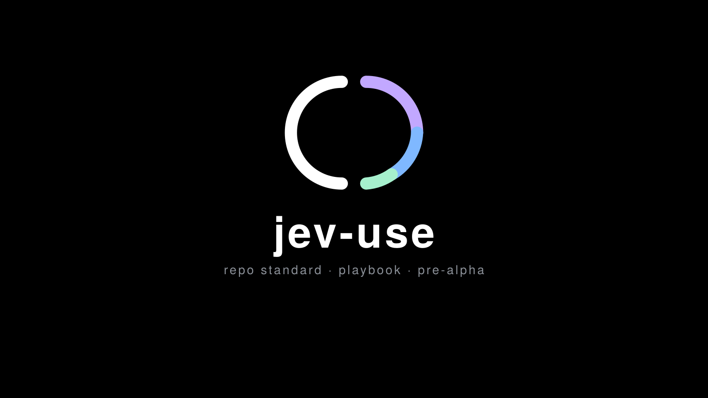

<div align="center">



# jev-use

**Voice-driven control layer for macOS**

`press a key · speak a goal · any app`


</div>


> **Speak a goal. The machine does it — across any Mac app, not just a browser.**

Status: **pre-alpha.** The Accessibility observation layer is being ported to Rust.
Nothing here is dogfood-ready yet; the working system still lives at
`~/code/jev-computeruse` (see `reference/`).

## The problem

Three problems that look like one:

| # | Problem | Today's cost |
| --- | --- | --- |
| 1 | **The model is the router.** Every agent run re-decides whether to use Jev, and can choose Playwright instead. | Prose in a config file, hoping it is followed |
| 2 | **State is scattered across ~8 apps.** "What is payments-api doing" means opening an app, finding a thread, reading it. | Minutes per question, by hand |
| 3 | **No single control surface.** Browser, editor, terminal, files, git — separate contexts. | Context-switch tax all day |

Only problem 1 needs Jev. The rest is queries and routing. That distinction is the whole
design: see `docs/prd.md`.

## The shape

```
voice -> intent -> does a purpose-built capability exist?
                       |
                 yes --+-- no
                  |        |
          run it (~50 ms)  +--> JEV (0.5–2 s/step, any app, any screen)
```

Most questions are queries, not agent tasks. "Status on payments-api" is a SQLite read that
takes about 50 ms. Making that an LLM call would be slower and worse. Jev's job is the
**long tail** — anything without a built-in.

## Layout

```
crates/jev-ax/       macOS Accessibility observation + execution (the port target)
crates/jev-voice/    voice hook path
docs/                prd, architecture, rules, design, tasks, memory
.metagpt/            STATE.md, GATE.json, interview.md — where we are and what gate we are at
reference/           points at the working Python system this is ported from
.github/             CI, PR template
docs/readme/         SpaceX/dark marketing assets
```

## Working on this

Read `AGENTS.md` first if you are an agent. Read `CONTRIBUTING.md` if you are a person.
The short version:

```bash
cargo test --workspace
cargo fmt --all
cargo clippy --workspace --all-targets -- -D warnings
```

**Every change lands as a small PR with CI green.** No direct pushes to `main`. A PR
without a passing run is not reviewable — see `.github/pull_request_template.md`.

## Keys: bring your own

**This repo contains no keys, and nothing in it will ever need ours.** Every component
reads credentials from your machine, in the form you choose:

| What | Where it looks | Override |
| --- | --- | --- |
| `scripts/usage-check` | Providers **you list** in `~/.config/jev-use/usage-check.json` (template: `scripts/usage-check.example.json`). Ships with none. | `JEV_USAGE_CONFIG`, `JEV_KEYS_FILE`, `JEV_AUTH_FILE`, `JEV_USAGE_DB` |
| `scripts/voice-hook` | Nothing. It reads no keys and calls no API; it decides, then hands a goal to *your* driver. | `JEV_USE_BIN`, `JEV_VOICE_MODE`, `JEV_VOICE_TRIGGER` |
| `crates/jev-ax` | Nothing. Accessibility reads, no network at all. | - |
| The driver that answers a goal | Whatever you already use. This repo ships none yet (T7). | - |

Two rules follow, and the gate enforces them:

1. **No credential is ever committed**, in code, docs, examples or test fixtures. The
   pre-push hook scans for key shapes, and `repo-check` scans every tracked file.
2. **No machine-specific path is committed.** `$HOME`-relative or an environment variable
   with a default - never someone's home directory baked in. `repo-check` fails on those.

Config lives outside the repo (`~/.config/jev-use/`), which is why a fork behaves like a
fresh install and asks for your keys instead of inheriting ours.

## Scripts

| Script | What it does |
| --- | --- |
| `scripts/install-voice-hook.sh` | Builds and installs the voice hook, then prints what to put in CoCo Voice's settings. |
| `scripts/voice-hook` | The file CoCo Voice runs per transcript. Reads its config from the environment. |
| `scripts/repo-check` | Audits a repo against the standing standard: required files, credentials, machine paths, docs. |
| `scripts/usage-check` | Where tokens and money went, from your own providers and the local turn log. |

## Licence

Apache-2.0. Chosen over MIT for the explicit patent grant, which matters for a project
that depends on other people's models and drivers. See `LICENSE`.

## Relationship to other projects

To avoid any confusion about what is official:

- **Jev** is TypeSafe's System One model. It is not ours, and this repo does not wrap or
  fork it.
- **`browser-use/jev-ultrafast`** is the upstream project this repo's browser counterpart
  comes from. The decision layer is **imported from it, never modified**. This repo is
  not an official Browser Use or TypeSafe project.
- **What is ours** is `crates/jev-ax`: the macOS Accessibility observation and execution
  layer, written in Rust, shaped so that decision layer can drive the desktop instead of
  a browser.

